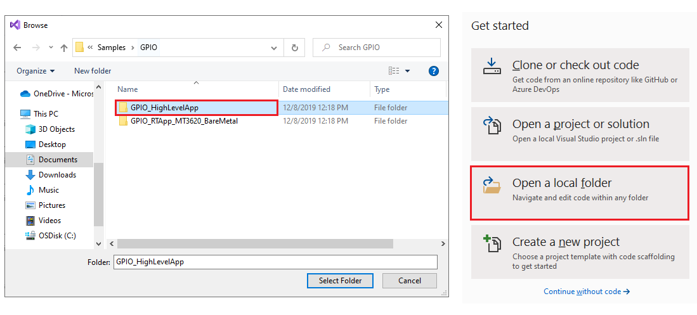
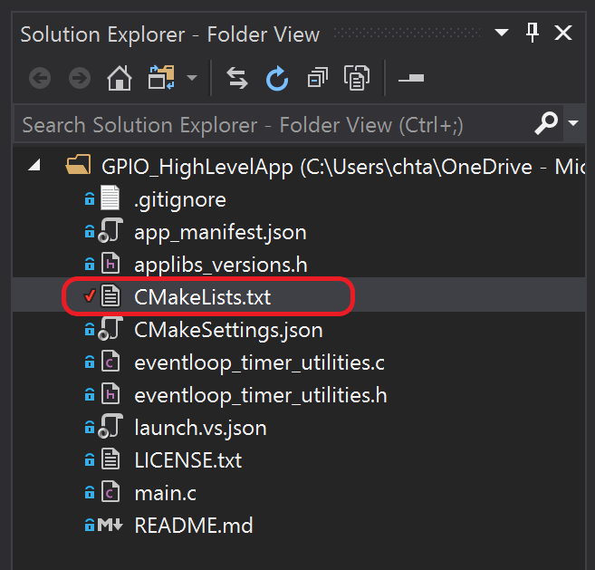
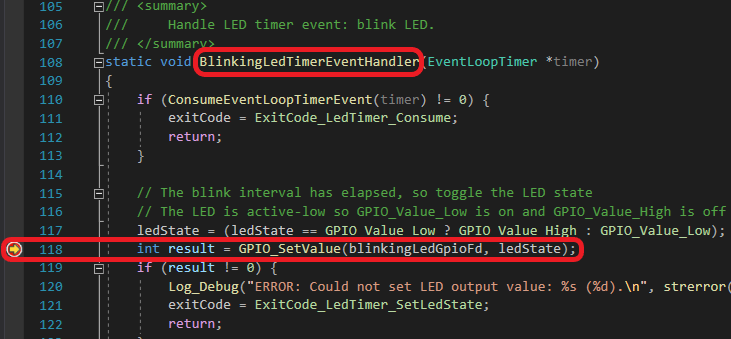

# Lab-1: Blinking LED

- Go to [Home Page](../README.md)

## Goals

- Understand the basic sketch of Azure Sphere High-level Application
- Leann how to build & debug Application using Visual Studio
- Learn how to use GPIO API from Azure Sphere SDK

## Steps

1. Enable device debug and disable OTA in Azure Sphere utility
   
   `azsphere device enable-development`

2. Clone Official Azure Sphere Samples repo

    `git clone https://github.com/Azure/azure-sphere-samples`

3. Open a local folder in Visual Studio and navigate to the folder of *.\azure-sphere-samples\Samples\GPIO\GPIO_HighLevelApp*, click **Select Folder** to open the CMake project.
   
    

4. **(Optional)** If you're using AVNET Dev Kit (AVNET_MT3620_SK), there're addtional modifications required as the official sample code are based on SEEED Dev Kit (MT3620_RDB board). Azure Sphere OS use [hardware definition file](https://docs.microsoft.com/en-us/azure-sphere/app-development/manage-hardware-dependencies) to abstract hardware. Double click CMakeLists.txt file in Solution Explorer.
    
    

    Set the Target Hardware Definition in CMakeLists.txt:
    - **azsphere_target_hardware_definition** to configure the Hardware Target Definition. 	In this case, please change the value of *TARGET_DIRECTORY* to avnet_mt3620_sk and save (CTRL+S). A CMake cache generation process will start and complete soon with `'1> CMake generation finished.'` message display at the end.

    

5. Select **GDB Debugger (HLCore)** as debug target and press **F5** to start build and load target application onto device for debugging. 
   
   

6. RED LED start to blink after Application is loaded. Press **Button A** will change the blinking rate. Both LED and Button A are connected to GPIO pin and controlled by the high-level Application.

7. Please search for function *BlinkingLedTimerEventHandler* and set a breakpoint on the line where function *GPIO_SetValue* is being called (Approx Line 109) by pressing **F9**, you will see the program is halt and stop on this line. Continue with **F5** and now you can control the ON/OFF state of LED.

 

## Read more
- [Using GPIOs on Azure Sphere](https://docs.microsoft.com/en-us/azure-sphere/app-development/gpio)
- [Best practices for high-level Application](https://docs.microsoft.com/en-us/azure-sphere/app-development/initialization-termination)
- [Manage target hardware dependencies](https://docs.microsoft.com/en-us/azure-sphere/app-development/manage-hardware-dependencies)

