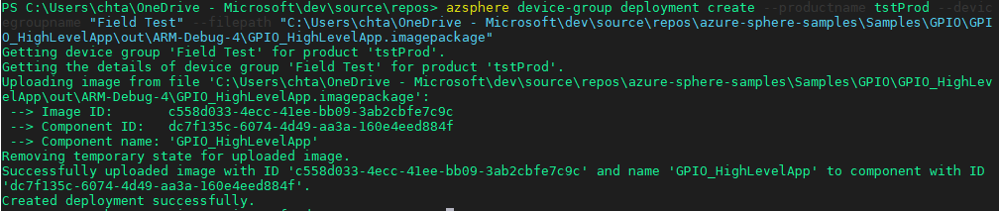

# Lab-2: Application Over-the-Air deployment

- Go to [Home Page](../README.md)

## Goals

- Learn how to configure WiFi network for Azure Sphere
- Learn how to use Azure Sphere utility to deploy an application Over-the-Air
- Understand all the concepts in Over-The-Air deployment
  
## Steps 

1. Configure the WiFi SSID and Password and allow Azure Sphere to connect Azure Sphere Security Service.
   
   `azsphere device wifi add --ssid <yourSSID> --psk <yourNetworkKey> --targeted-scan`
   
   > - To add an open network, omit the --psk parameter
   > - If your network SSID or key has embedded spaces, enclose in quotation marks, e.g. --ssid "My SSID"
   > - It is always good to include the --targeted-scan parameter, as it will auto attempt to auto-connect to an SSID even though if not broadcasted 

2. Check WiFi status and confirm it is connnected to the AP.
   
   `azsphere device wifi show-status`

    
    
3. Before your devices can receive applications from the cloud, they must have a product and belong to a specfic device group. Create a *product* and assign an unique name, record the GUID for later use. The description parameter is optional. 

   `azsphere product create --name <product-name> --description <optional-desc>`

    By default, each product has five device groups: 

    |  Device Group Name       | App Update  | OS Update | 
    |  ----------------        | ----------  | --------- | 
    | Development              | Disabled    | Retail Evaluation OS |
    | Field Test               | Enabled     | Retail OS |
    | Field Test OS Evaluation | Enabled     | Retail Evaluation OS |
    | Production               | Enabled     | Retail OS |
    | Production OS Evaluation | Enabled     | Retail Evaluation OS |

4. To enable application OTA, device must be placed into one of the specific device group and the **AppDevelopment** capability (was given by `enable-development` command in Lab-1) has to be **DISABLED**. Use the following command to switch the current connected device into 'Field Test' group of the selected product.
   
    `azsphere device enable-cloud-test --productname <name of product>`

   At this point, you will observed that the previously loaded LED blinking application does not function anymore.

5. You may also check the status of your device by using 
   
	`azsphere device show`
	
	

6. After the project is successfully built, Visual Studio will package the application (together with other metadata) into a *.imagepackage* file which will be use for deployment. The *.imagepackage* file is located under the folder `out/ARM-Debug-4/` of the project root folder. Please take down the full path where it will be use in the next step.

7. A deployment target will deplay to all devices within a device group. Create a deployment to the default 'Field Test' device group under the specificed product by:

    `azsphere device-group deployment create --productname <name of product> --devicegroupname "Field Test" --filepath <path to imagepackage>`
	
	

8. Reset the board either by pressing the middle **RST Button** or via the command line 
	
	`azsphere device restart`

   Please wait for a few minutes, you will observed that the RED LED will start to blink.  This indicate that the application has been successfully deployed via OTA.

9. To create a new version of the application and deploy will be the same as step 6. Please take note that every time a new build will generate a different Image ID and tracked by AS3. 
    
## Challenge

The RGB LED connect to 3 different GPIO of MT3620. Try to change the color of blinking from RED to GREEN through a new deployment over the air!

> **HINT:** Use chip level abstraction `MT3620_GPIO9` to replace the previous `SAMPLE_LED` for both MT3620_RDB and AVNET_MT3620_SK board.  Please make sure you grant the permission via the application manifest.

**NOTE:** it is always a good habit to test / verify your new changes or functionality (by switching back to development state) before deploying it via OTA.

## Read more
- [Connect Azure Sphere to Wi-Fi](https://docs.microsoft.com/en-us/azure-sphere/network/wifi-including-ble)
- [Deloyment basics](https://docs.microsoft.com/en-us/azure-sphere/deployment/deployment-concepts)
- [Create a deployment](https://docs.microsoft.com/en-us/azure-sphere/deployment/create-a-deployment)
- [Applicaiton Manifest](https://docs.microsoft.com/en-us/azure-sphere/app-development/app-manifest)