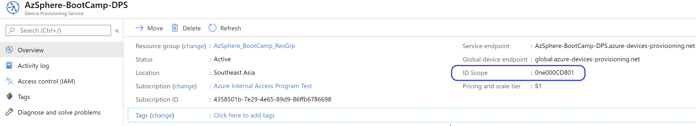
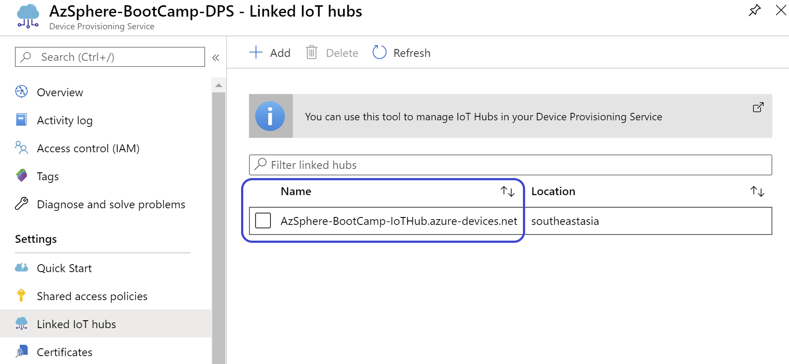
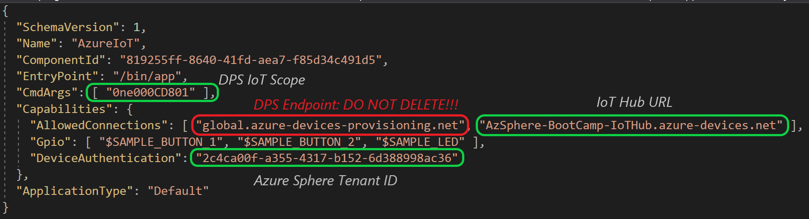
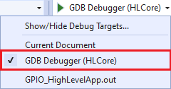
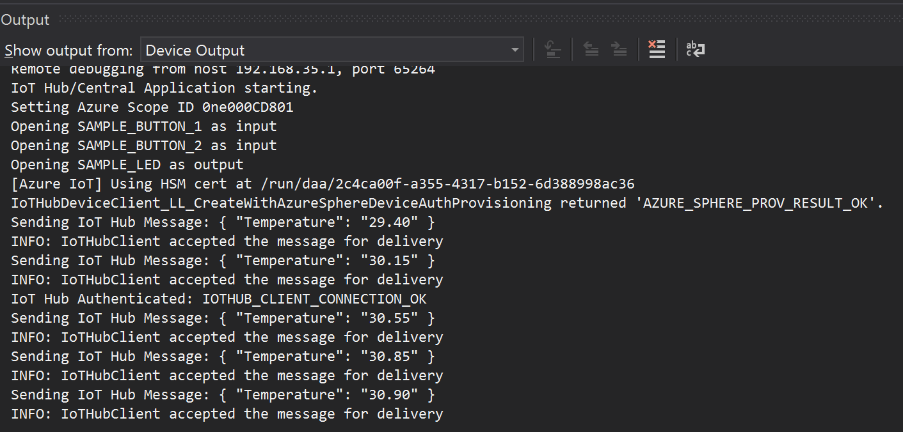
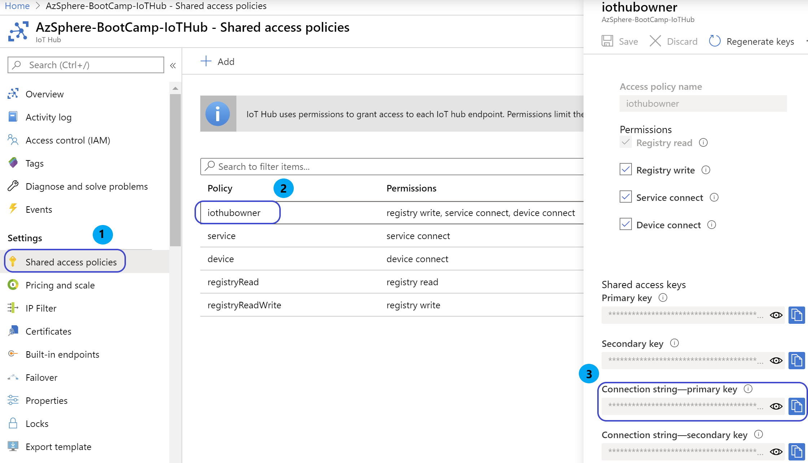
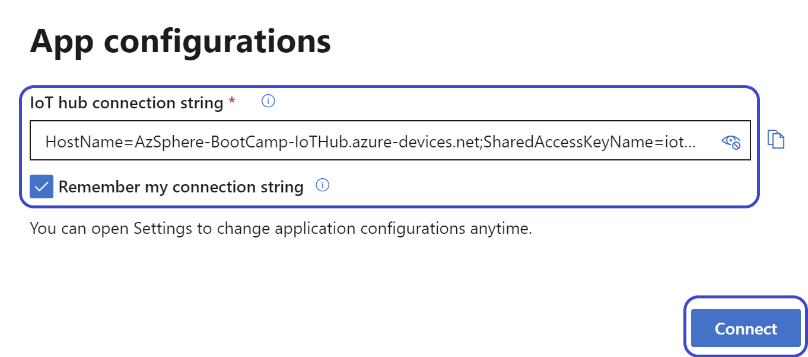
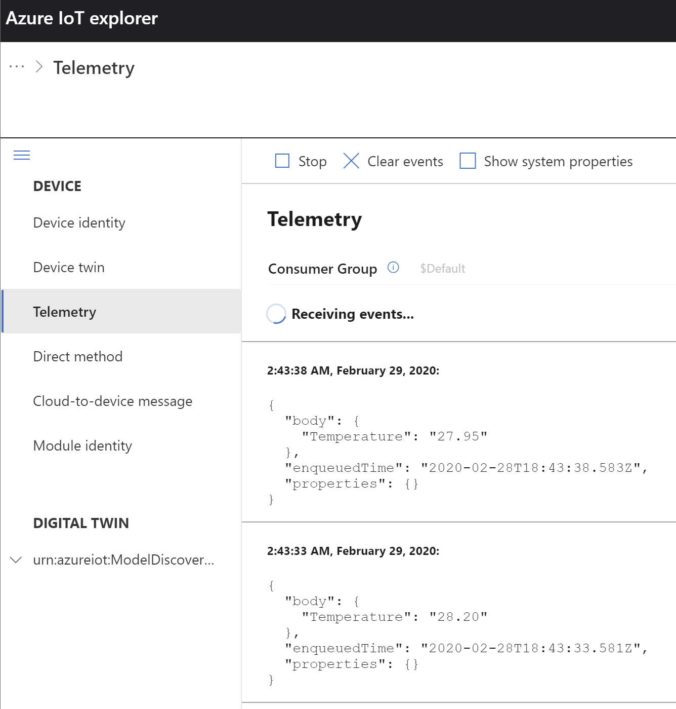
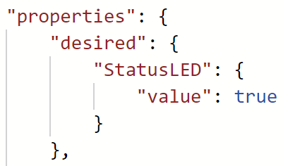
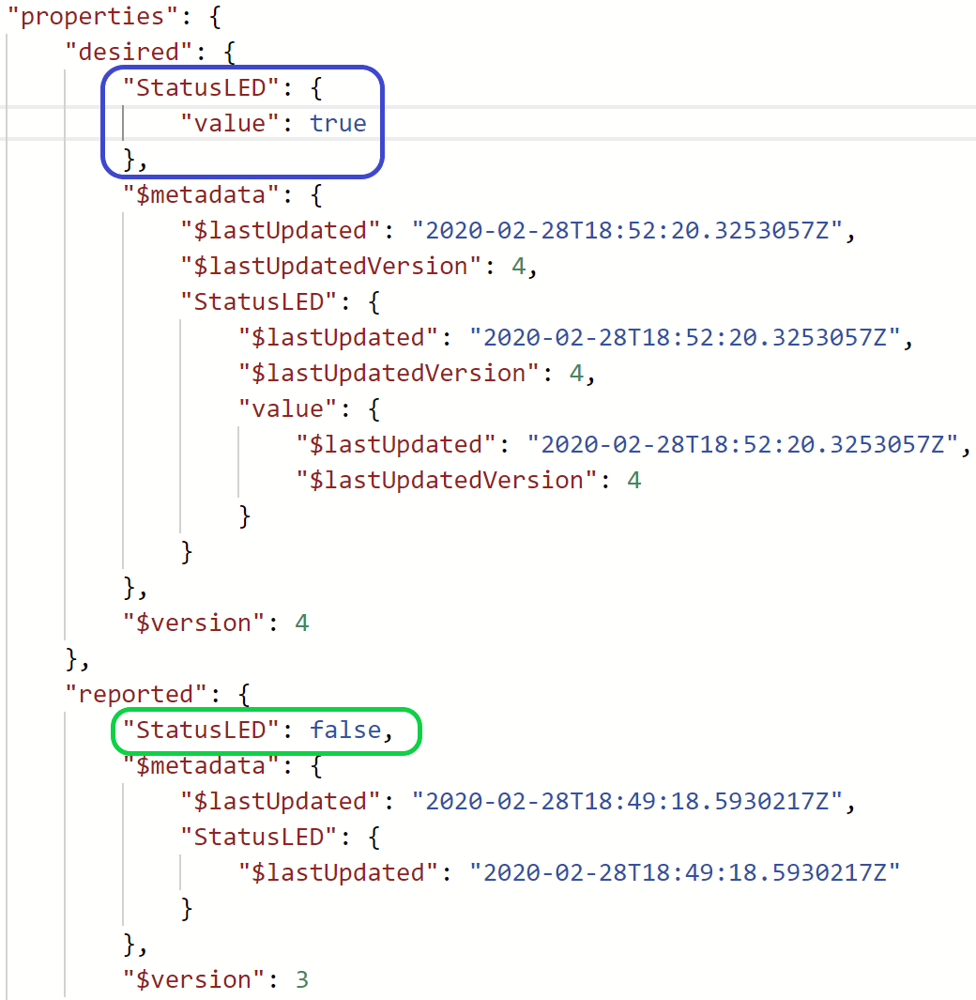

# Lab-3: Connect to Azure IoT Hub

- Go to [Home Page](../README.md)

## Goals

- Hands-on with Azure IoT Hub configuration
- Understand how will IoT Hub DPS provision Azure Sphere device
- Understand Azure IoT Hub Device to Cloud message and Device Twin
- Get familiar with the basics of Azure IoT C device SDK API

## Steps

1. Follow [Setup IoT Hub](https://docs.microsoft.com/en-us/azure-sphere/app-development/setup-iot-hub) page to setup cloud resources, the key steps are:
    
    - Create Azure IoT Hub and DPS and link them
    - Upload tenant CA certificate to DPS and finish Proof of Procession
    - Add a enrollment group in DPS to provision Azure Sphere devices

> Azure IoT Hub DPS service do not allow to use free subscription, You should use a pay-as-you-go subscription for this lab. 

1. After connect hardware to your PC, enable device debug and disable OTA in Azure Sphere utility by:
   
   `azsphere device enable-development`

2. Make sure WiFi credential is configured and Azure Sphere is connected to the WiFi Access Point. If Lab-2 is skipped, please follow Step 1) and 2) in [Over-The-Air upgrade](lab-2.md) to configure the WiFi.

3. Please open the AzureIoT project in *.\azure-sphere-samples\Samples\AzureIoT* folder. If you're using **AVNET_MT3620_SK** board, please ensure that the hardware definition file is updated. Please refer to Step 4 in [Lab-1](lab-1.md) to get the hardware definition file updated.
   
4. Before building the project, there are three key information that need to be provided to the applicaton via the app_manifest.json file.
   
   1. **The Tenant ID of Azure Sphere device** - At the Azure Sphere CLI, use the following command to get the tenant ID. Copy the returned value and paste it into the DeviceAuthentication field of the app_manifest.json file:

	   `azsphere tenant show-selected`
	
   2. **The Scope ID for the Device Provisioning Service (DPS) instance** - Log in to Azure Portal and navigate to your DPS.  In the summary screen at the top right, copy the ID Scope value and paste it into the **CmdArgs* field of the app_manifest.json file.

	   

   3. **The Azure IoT Hub URL** - Under DPS Settings, select Linked IoT Hubs. Copy the Service endpoint values(s) for the Azure IoT Hub(s) and append them to the AllowedConnections field of the app_manifest.json file
   
       
	
	Once all the **3 important** fields has been tabulated, save the modified app_manifest.json file.
   
   
   
   For more details on how to obtain these 3 key information please refer to this [link](https://github.com/Azure/azure-sphere-samples/blob/master/Samples/AzureIoT/IoTHub.md#configure-the-sample-application-to-work-with-your-azure-iot-hub).

   > **IMPORTANT!** Please **DO NOT DELETE** the exisiting DPS global endpoint *global.azure-devices-provisioning.net* in the *AllowedConnections* field

5. Select **GDB Debugger (HLCore)** as debug target and press **F5** to start the build and loading of the target application onto device for debugging. 
   
   
   
6. From the local device output log window, it shows that the device is currently sending simulated telemetry data to the IoT Hub upon successful connection. 
   
   

    > Azure IoT Hub is the core PaaS that enable reliable and secure bi-directional communications between millions of IoT devices and cloud solution. It exposed service APIs for user to integrate enterprise / business backend for data analystics, storage, visualization and more. In this Lab, we will be using a tool called **Device Explorer Tool** to simulate a simple user application to sink data and to control the IoT device.

7. Please Download and install [Azure IoT Explorer.msi](https://github.com/Azure/azure-iot-explorer/releases/download/v0.10.9/Azure.IoT.explorer.0.10.9.msi), the latest cross-platform management tool for Azure IoT platform

8. Please navigate to your IoT Hub portal and under Settings, select **Shared access policies**.  Under Policy column, locate and select **iothubowner**.  Please copy the Primary connection string by clicking on the copy icon.
   
   

9.  Open the **Azure IoT Explorer** and paste the connection string to the dialog, click **Connect** to get access to the intended IoT Hub. 
   
   

11. Select the already connected device and go to *Telemetry* tab, click on the **Start** button to start the reading of telemetry data from the build-in endpoint of IoT Hub
   
   

12. In the sample code, the LED is controlled by the Device Twin mechanism. Go to *Device Twin* tab where you will find the whole device twin document residing on the cloud. In the Device Twin window, please add an entry of `"StatusLED":{"value":true}` under the `"desired"` property and remove all other key-value. Once done, click the **Save** button to update the Device Twin. Your device will be notified for this specific property change and turn on the LED on the board accordingly. 
    
    

13. User may click **Refresh** button to get the updated device twin document. In `"reported"` section you may find the latest status reported from the device. 

    

## Read more
- [Azure Sphere Application Manifest](https://docs.microsoft.com/en-us/azure-sphere/app-development/app-manifest)
- [Provisioning device with Azure IoT Hub DPS](https://docs.microsoft.com/en-us/azure/iot-dps/about-iot-dps)
- [IoT Hub D2C message](https://docs.microsoft.com/en-us/azure/iot-hub/iot-hub-devguide-messages-d2c)
- [IoT Hub Device Twin](https://docs.microsoft.com/en-us/azure/iot-hub/iot-hub-devguide-device-twinsp)
- [Azure IoT C SDK](https://github.com/Azure/azure-iot-sdk-c)