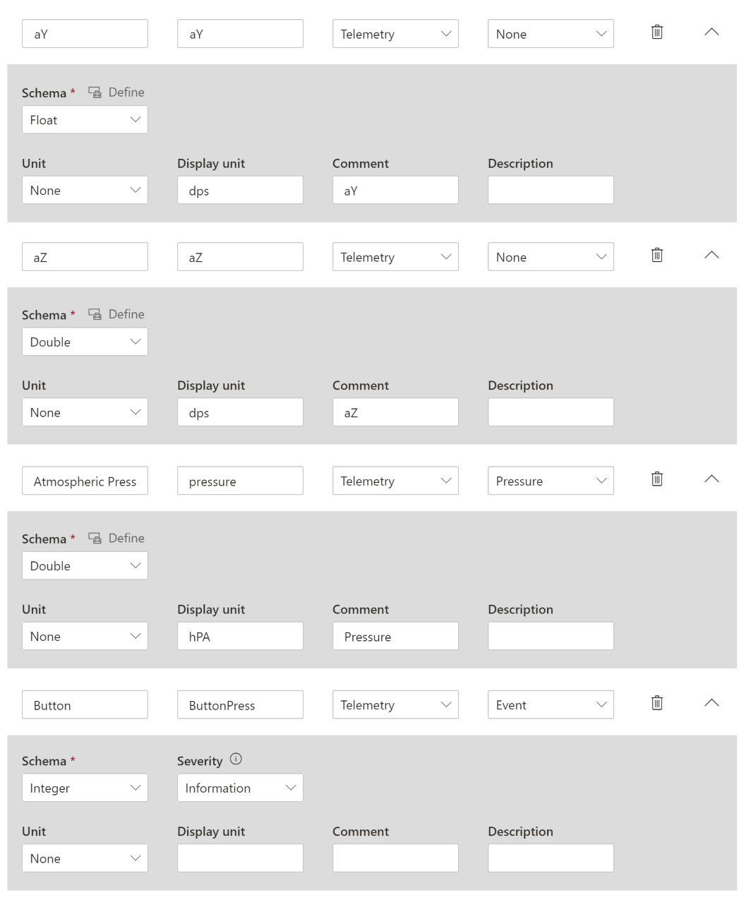
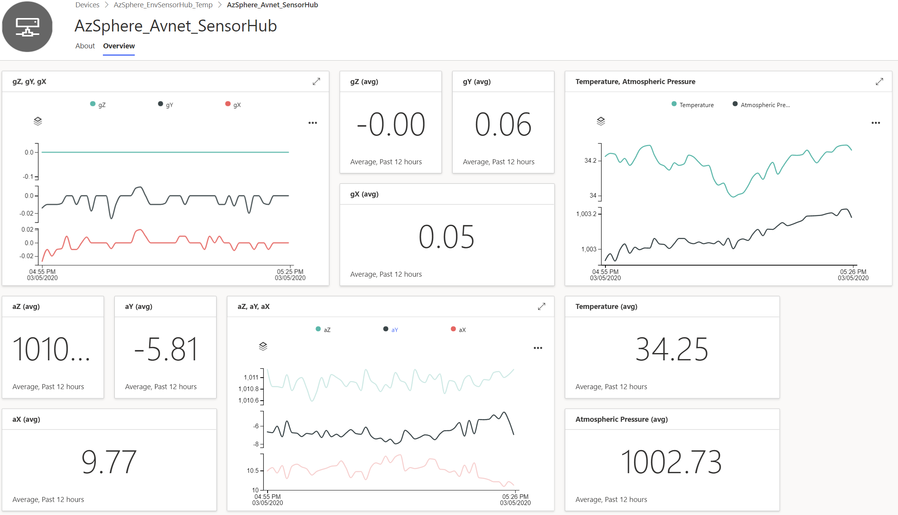

# Lab-4: Visualize real world data on Azure IoT Central

- Go to [Home Page](README.md)

## Goals

- Hands-on with Azure IoT Central configuration
- Understand the basic feature of IoT Central offered as a IoT SaaS solution
- Get familiar with I2C API to connect to external sensor device
- Use Azure Sphere and Azure IoT Central work together to build a secured end-to-end solution with telemtery collection, visulization and remote control ability.

## Steps

1. After connect Azure Sphere development board to your PC, enable device debug and disable OTA in Azure Sphere utility
   
   `azsphere device enable-development`

2. Make sure WiFi credential is configured and Azure Sphere is connected to the WiFi Access Point. If Lab-2 is skipped, please follow Step 1) and 2) in [Over-The-Air upgrade](lab-2.md) to configure the WiFi.
   
3. Please follow the following link [Setup IoT Central](https://docs.microsoft.com/en-us/azure-sphere/app-development/setup-iot-central) to setup the cloud resources, the importants steps are:
    
    - Login to Azure IoT Central with your Azure credentials
	- Create an Azure IoT Central Application
    - Upload tenant CA certificate to IoT Central and finish Proof of Procession

4. Next is to create a device template in IoT Central.  Go to your application in [Azure IoT Central](https://apps.azureiotcentral.com/) and select Device Templates page under the application section.  Create a custom device template by choosing the **IoT Device** as a start.  

	

5. Click **Next: Customize** and in the next page, leave the **Gateway device** unchecked; click on **Next: Review** --> finally **Create** the custom template.  Enter a name for your template, such as **Sensor Hub*.

	

6. You also need to create a device capability model and add a set of custom interface for your device.  Make use of the telemetry data to tabulate the device capabilities and the associated interfaces.  See following example: -

	
	

7.  You may use the general default view or add your own customization and selecting the various dashboard views. Before you can connect a device that implements your device capability model, you must publish your device template.  To publish a device template, go to you your device template, and select Publish.

8. After you had published your newly created template, its time to create your new device. On the left hand side of the navigation pane, select Devices, click + to add a new device and enter Device ID and Name. 

	Please use the following command to get the Device ID:

	`powershell -Command ((azsphere device show-attached)[0] -split ': ')[1].ToLower()`

	Copy the lowercase device ID and paste it into the Device ID field of the Create New Device dialog box. Device name will be changed automatically using the device ID appended. Click Create butt

9. After you have created the new device, click on "Approve" and follow by "Migrate" where you will now associate the Device with the device template that was just created. Oce you have done associating it, the Device Status will become "Registered"

   
10. Before building the project, there are three key information that need to be provided to the applicaton via the app_manifest.json file.
   
	- **The Tenant ID of Azure Sphere device** - At the Azure Sphere CLI, use the following command to get the tenant ID. Copy the returned value and paste it into the DeviceAuthentication field of the app_manifest.json file:

	   `azsphere tenant show-selected`
	   
	- **Scope ID** for your Azure IoT Central application can be found in the Administration/Device connection page of IoT Central

	
		
	- **IoT Hub URL** for your Azure IoT Central application, to get this **IoT Hub URL**, there is a need for a tool in *.\azure-sphere-samples\Samples\AzureIoT\Tools* folder that can help. In Azure Sphere command line utility, go to above location, and run `ShowIoTCentralConfig.exe`, input 'Y' and provide the following information

		1. Scope ID
		2. Device ID
		3. The device key, in this case the SAS Primary key
		
		

		Once all the **3 important** fields has been tabulated, save the modified app_manifest.json file.

		

11. Last set of changes before you start compiling
	
	- Please remember to update the CMake list file ("CMakeLists.txt") to add i2cDevice.c, lps22hh_reg.c and lsm6dso_reg.c to the ADD_EXECUTABLE parameter. 
	- If you're using **AVNET_MT3620_SK** board, follow Step 4 in [Lab-1](Lab-1.md) to modify hardware definition file and grant ISU2 I2C access permission to application in app_manifest.json.  
	- Last but not least, you will need to make changes to the code to visualize your real world data by 
	
		1. Iniitializing the Sensor Hub at during peripheral initializatoin
		2. Replacing the Send Simulated data with the real Sensor Hub send data API call.
				
			> **HINT:** `initI2cDevice()` and  `SensorHub_SendData()` The Avnet SensorHub (LSM6DSO and LPS22HH) source files can be found in "src/lab-4/sensorhub_lsm6ds0_lps22hh"
		
		**NOTE:** Alternatively, you can also apply the patch *0001-AzSphere_Tutorial-Lab-4-Answers.patch* which can be found in "src/lab-4/answer" and study the code changes directly.  Please use the following git command to apply a patch
		
		`git apply <patch_file>`

		**IMPORTANT:** Before applying the patch, please backup your modified app_manifest.json as it will overwrite the valid value of your *Tenant ID, Scope ID and IoT Hub URL!*	

12. After finishing all the configuration and code changes, select **GDB Debugger (HLCore)** and Press F5 to build and run the applicaiton. Go to the device dashboard to check your data.

    
	

## Read more

- [What is Azure IoT Central](https://docs.microsoft.com/en-us/azure/iot-central/overview-iot-central)
- [Azure IoT Central Architecture](https://docs.microsoft.com/en-us/azure/iot-central/concepts-architecture)
- [Defining new IoT device templatein Azure Central](https://docs.microsoft.com/en-us/azure/iot-central/core/howto-set-up-template)
- [Use I2C with Azure Sphere](https://docs.microsoft.com/en-us/azure-sphere/app-development/i2c)
- [Manage target hardware dependencies](https://docs.microsoft.com/en-us/azure-sphere/app-development/manage-hardware-dependencies)

